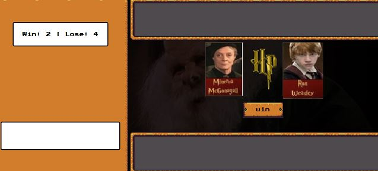

## 🎮 Desafio de Projeto Ri Happy: Jogo - Harry Potter Card 
Projeto desenvolvido em HTML, CSS e JavaScript, para criação do jogo de cartas. 
Esse projeto foi proposto por Felipe Aguiar da plataforma educacional DIO.

## 🖥 Preview do Jogo:

## 👨‍💻 Objetivo:
- Reproduzir passo passo o projeto visto em aula.

## 🤔 O que foi feito de diferente nesse jogo:
- As cartas do jogo foram baseadas do filme Harry Potter, onde montei as cartas de acordo com imagens do pinteres.
- Foram escolhidos 12 cartas, o jogo sorteará 5 cartas para o computador e jogador aleatoriamente.
- A música tocada no jogo e o vídeo do fundo pertencem ao momento  correspondente aos filme, baixei tanto a música como o vídeo do Youtube.
- Favicon utilizei da imagem de logo do filme
 cursor do mouse utilizei o mesmo que já tinha.

### 🛠️ Tecnologia Utilizada 🛠️
Algumas das tecnologias e linguagens que utilizamosforam utilizadas:

- Javascript
- CSS
- HTML
- VSCode

## 📌 Créditos
Este jogo foi desenvolvido como parte de um projeto educacional da Digital Innovation One.